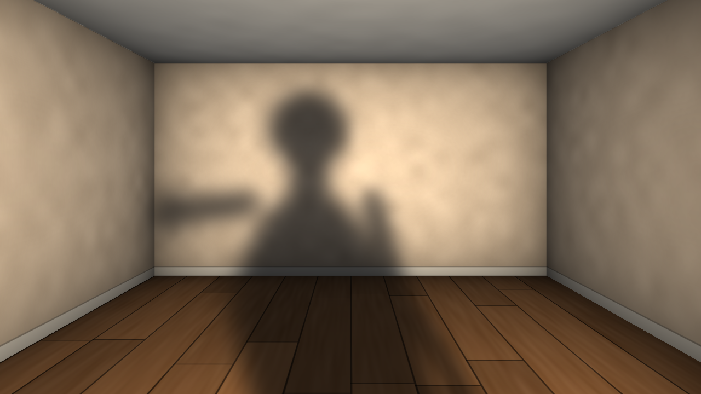

# Virtual Shadow Projection

Noutbuk veb-kamerasi harakatingizni real vaqtda kuzatadi va virtual 3D xonaning
devorlari, poli va shiftiga, xuddi siz o‘sha xonada turgandek, yumshoq soya tushiradi.



## 1. Texnologiyalar tanlovi

| Qism | Tanlov | Nega |
|---|---|---|
| Til | Python 3.9–3.12 | Bitta skript, o‘rnatish oson |
| Kamera va grafika | OpenCV | Kamera, blur, `warpPerspective`, to‘liq ekranli oyna. Hammasi C++ da ishlaydi, shuning uchun tez |
| Segmentatsiya | MediaPipe Selfie Segmenter (Tasks API) | CPU da taxminan 5 ms, GPU shart emas |
| 3D | Gomografiya (3×3 matritsa) | OpenGL kerak emas: har kadrda faqat 5 ta warp bajariladi |

Kutubxonalar: `opencv-python`, `numpy`, `mediapipe`. Pygame yoki OpenGL kerak emas.

## 2. Arxitektura

```
[Kamera oqimi, ~30 FPS]                    [Render oqimi, ~60 FPS]
kadr → oyna effekti (flip)                 moslashuvchan EMA (silliqlash + interpolyatsiya)
     → MediaPipe → siluet maskasi  ──────► maska + "oyoq" davomi
                                           → Gaussian blur (penumbra)
                                           → spot-konus × (1 − soya)
                                           → 5 ta gomografiya (devor/pol/shift)
                                           → Lambert + masofa so‘nishi
                                           → fon × (ambient + chiroq)
```

**Asosiy fizik g‘oya.** Nuqtaviy chiroq tushirgan soya aynan shu chiroq nuqtasidan
ko‘rinadigan siluetning o‘zi. Shuning uchun dastur veb-kamerani virtual chiroq deb
hisoblaydi. Siluet maskasi diaproyektor kabi xonaning har bir tekisligiga markaziy
proyeksiya qilinadi. Tekislik `n·X = c` uchun:

```
X = L + (c − n·L)/(n·d) · d   ⇒   H = P_ekran · [L nᵀ + (c − n·L)I ; nᵀ] · R_chiroq · K_chiroq⁻¹
```

Natija aniq 3×3 matritsa. Soya devordan polga va yon devorga uzilmasdan, perspektivaga
to‘g‘ri mos holda o‘tadi.

- **Masking.** MediaPipe odam ehtimolligini 0..1 oralig‘ida qaytaradi. `smoothstep(0.3, 0.7)` shovqinni kesadi, lekin qirralarni silliq qoldiradi.
- **Yumshoq soya.** Blur burchak bo‘yicha (proyektor fazosida) qo‘llanadi. Shuning uchun uzoqdagi yuzada penumbra kengroq bo‘ladi, xuddi haqiqiy soyadagidek.
- **Oyoq davomi.** Kamera odatda faqat beldan yuqorini ko‘radi. Soya havoda osilib qolmasligi uchun maskaning pastki qatori polgacha asta toraytirib cho‘ziladi (`L` tugmasi bilan yoqiladi yoki o‘chiriladi).
- **Silliqlash.** Moslashuvchan EMA (One-Euro filtri g‘oyasi) ishlatiladi. Tinch turganingizda kuchli filtr titrashni yo‘qotadi, tez harakatda filtr kuchsizlanadi va kechikish sezilmaydi. Kamera va render alohida oqimlarda ishlaydi, shuning uchun 30 FPS kamera bilan ham render 60 FPS da silliq interpolyatsiya qilinadi.

## 0. Eng tez yo‘l: bir marta bosib ishga tushirish

Hech narsani qo‘lda o‘rnatish shart emas. Birinchi ishga tushirishda skript virtual
muhit (`.venv`) yaratadi va barcha kutubxonalarni o‘zi o‘rnatadi (taxminan 1–3 daqiqa).
Keyingi safar dastur darhol ochiladi.

| Tizim | Nima qilish kerak |
|---|---|
| **Windows** | `start_windows.bat` faylini ikki marta bosing. Python bo‘lmasa, `winget` orqali o‘zi o‘rnatishga harakat qiladi |
| **macOS** | `start_mac.command` faylini ikki marta bosing (birinchi marta: o‘ng tugma → Open) |
| **Linux** | `./start_mac_linux.sh` |

Parametrlarni ham berish mumkin: `start_windows.bat --demo` yoki `./start_mac_linux.sh --room garaj.jpg`.

Loyihani yuklab olish: GitHub’da **Code → Download ZIP** tugmasini bosing, arxivni oching va `virtual-shadow-projection` papkasiga kiring.

## 3. Qo‘lda o‘rnatish (ixtiyoriy)

```bash
# (tavsiya) virtual muhit
python -m venv .venv
# Windows:  .venv\Scripts\activate
# macOS/Linux:  source .venv/bin/activate

pip install opencv-contrib-python numpy mediapipe
# yoki: pip install -r requirements.txt
```

Birinchi ishga tushirishda segmentatsiya modeli (taxminan 250 KB) avtomatik yuklab
olinadi va `~/.cache/virtual_shadow/` papkasiga saqlanadi. Buning uchun internet kerak,
keyingi ishga tushirishlarda esa kerak emas.

## 4. Ishga tushirish

```bash
python virtual_shadow.py                   # protsedural 3D xona, to‘liq ekran
python virtual_shadow.py --windowed        # oynada ochish
python virtual_shadow.py --demo            # kamerasiz sinov (sintetik siluet)
python virtual_shadow.py --camera 1        # boshqa kamera
python virtual_shadow.py --room garaj.jpg  # o‘z xona yoki garaj rasmingiz
```

Eng yaxshi natija uchun kameradan 1–2 metr uzoqlikda turing. Orqa fon oddiy bo‘lsa,
segmentatsiya ham tozaroq chiqadi.

### Tugmalar

| Tugma | Vazifa |
|---|---|
| `W` `A` `S` `D` | Chiroqni yuqoriga, chapga, pastga, o‘ngga siljitish (soya teskari tomonga siljiydi) |
| `Z` / `X` | Chiroqni oldinga yoki orqaga siljitish |
| `+` / `-` | Soya o‘lchami |
| `[` / `]` | Yumshoqlik (penumbra) |
| `,` / `.` | Soya quyuqligi |
| `L` | Oyoq davomini yoqish yoki o‘chirish |
| `M` | Kamera va maskani ko‘rsatish |
| `H` | Yordam matnini yashirish |
| `F` | To‘liq ekran rejimini almashtirish |
| `P` | Skrinshot |
| `R` | Sozlamalarni tiklash |
| `C` | Rasmni kalibrlash (`--room` rejimida) |
| `Q` / `Esc` | Chiqish |

## 5. Xona rasmini yoki fonni almashtirish

1. Old tomondan olingan xona, garaj yoki avtomobil turgan zal rasmini tayyorlang (JPG/PNG).
   Rasmda orqa devor to‘liq ko‘rinib turishi kerak (bir nuqtali perspektiva). Rasm ekran
   nisbatiga (16:9) avtomatik moslab kesiladi.
2. `python virtual_shadow.py --room garaj.jpg` buyrug‘ini ishga tushiring va `C` tugmasini bosing.
3. Sichqoncha bilan 6 ta nuqtani bosing:
   1. orqa devorning yuqori-chap burchagi;
   2. yuqori-o‘ng burchagi;
   3. pastki-o‘ng burchagi;
   4. pastki-chap burchagi;
   5. pol bilan chap devor tutashgan chiziqdagi istalgan nuqta (ekranning pastrog‘ida);
   6. pol bilan o‘ng devor tutashgan chiziqdagi istalgan nuqta.

   Noto‘g‘ri bosilgan nuqtani sichqonchaning o‘ng tugmasi bekor qiladi.
4. Kalibrlash `garaj.calib.json` fayliga saqlanadi va keyingi safar avtomatik yuklanadi.
   Xona chuqurligi noto‘g‘ri ko‘rinsa, JSON dagi `focal` qiymatini o‘zgartiring
   (standart 0.8: katta qiymatda xona chuqurroq bo‘ladi).

Fotoning o‘z yorug‘ligi bor, shuning uchun bu rejimda `--ambient 0.55 --key 0.65`
standart qiymatlar ishlatiladi. Rasm juda qorong‘i yoki juda yorug‘ chiqsa, shu ikki
parametrni o‘zgartiring.

Protsedural xonaning o‘lchamlarini o‘zgartirish uchun skriptdagi `DEFAULT_PROCEDURAL`
qiymatlarini tahrirlang: yo‘qolish nuqtasi, orqa devor to‘rtburchagi va fokus.

## 6. Jonli fon (wallpaper) sifatida ishlatish

- Eng oddiy usul: `python virtual_shadow.py` to‘liq ekranda ochiladi va `H` tugmasi yordam matnini yashiradi.
- Windows’da [Lively Wallpaper](https://www.rocksdanister.com/lively/) yordamida ilovani ish stoli foni sifatida ishga tushirish mumkin.

## 7. Unumdorlik va muammolar

- Dastur odatda 1 ta CPU yadrosining taxminan 30–50 foizini ishlatadi. Kompyuter sekin bo‘lsa, `--light-scale 0.35 --mask-width 160 --fps 30` parametrlarini sinab ko‘ring.
- Kamera ochilmasa, dastur avtomatik ravishda demo rejimga o‘tadi. Boshqa kamera uchun `--camera 1` ni sinab ko‘ring.
- MediaPipe o‘rnatilmasa, dastur OpenCV MOG2 zaxira usuliga o‘tadi (sifati pastroq).
- Linux’da `libEGL.so.1` xatosi chiqsa: `sudo apt install libegl1 libgles2`.
- MediaPipe odatda Python 3.9–3.12 uchun chiqariladi. Python 3.13 da xato bersa, Python 3.11 ni o‘rnating.
